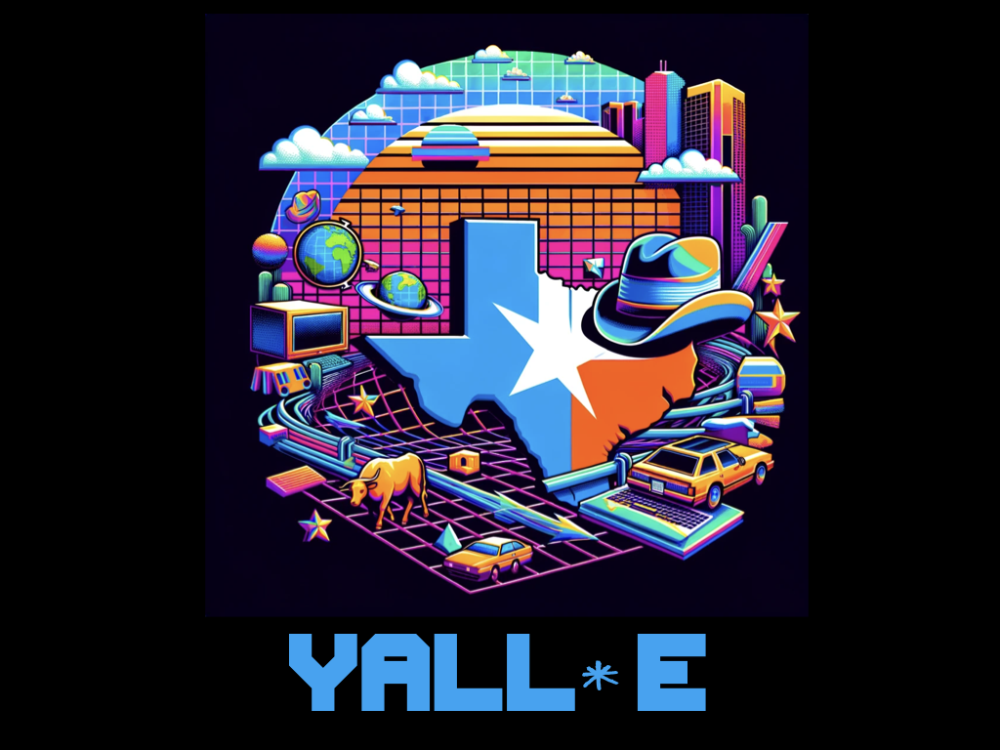

# YALL\*E



## A LoneStar Codin' Experience

Experts have prophesied that American regional accents will one day be extinct. YALL\*E is a coding language for anyone who (like me) grew up hearing the soothing sounds of a Texas drawl and will miss it when it's gone, and/or anyone who wants to bring a little wild west, rootin-tootin' LoneStar spirit to their hoity-toity, city-fied code.

(editors note to Dr. Toal: I wish I had a bit more inspiration to do a language that served a function vs just tweaking commands to a dialect, but currently haven't had that bolt of inspiration (plus feeling a bit out of my depth in this class), so rolling with this for now. Stretch goal is to add something else that makes it fun or answers a coding need, but still hunting for that)

## Features

- Statically typed
- Loops
- Classes
- Functions
- Nesting
- Texas pun

## Example Tasks

### Printing

<table>
<tr> <th>JavaScript</th><th>YALL*E</th><tr>
</tr>
<td>
```javascript
console.log(“Hello world!”)
```
</td>
<td>
```
holler “Hello world!”
```
</td>
</table>

### Printing

<table>
<tr> <th>JavaScript</th><th>YALL*E</th><tr>
</tr>
<td>
```javascript
console.log(“Hello world!”)
```
</td>
<td>
```
holler “Hello world!”
```
</td>
</table>

### Variable Assignement

Lassoes are for variables you may want to assign then reassign. Brands are for constants that will never leave their herd.

<table>
<tr> 
<th>JavaScript</th>
<th>YALL*E</th><tr>
</tr>
<td>
let horseshoes = 10
</td>
<td>
lasso horshoes = 10
</td>
</table>
